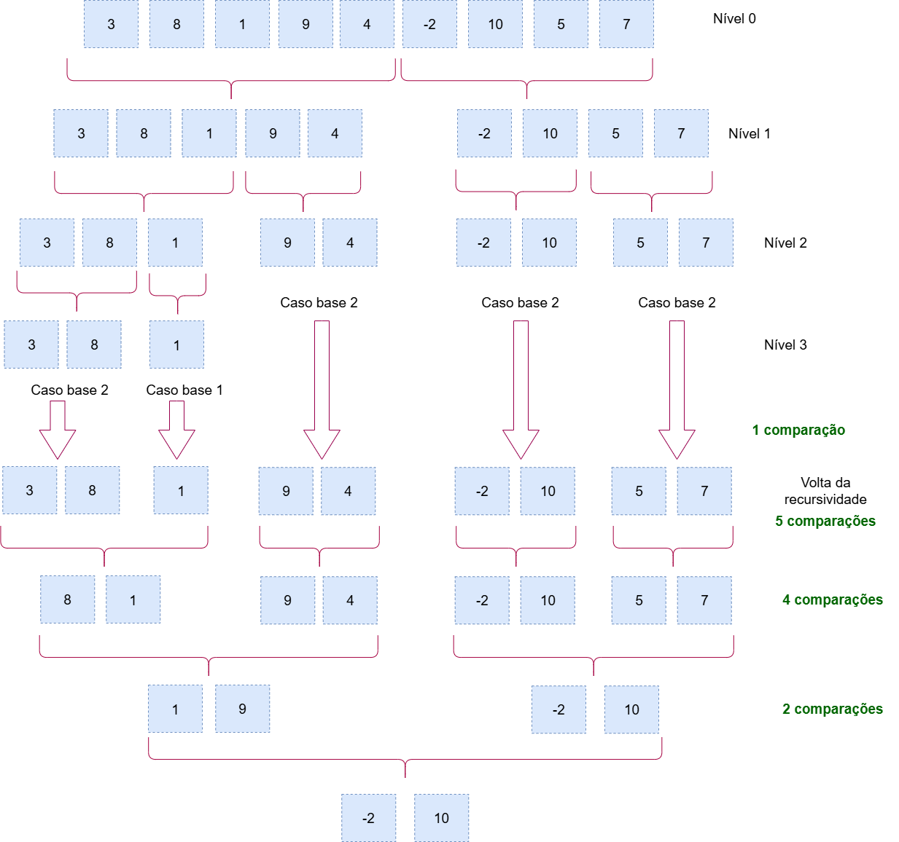

# Algoritmo de Seleção Simultânea do Maior e do Menor Elementos (MaxMin Select) 
## Sobre o projeto
Este projeto consiste na implementação do algoritmo de seleção simultânea do maior e do menor elementos (MaxMin Select) de uma sequência de números, utilizando a abordagem de divisão e conquista.

## Como executar o projeto
### Pré-requisitos:

Ter o Python 3 instalado. Especificamente, este projeto foi desenvolvido na versão 3.10.11 do Python.

### Passos:

• Faça o download ou clone este repositório.

• Abra o terminal ou prompt de comando e navegue até a pasta onde você salvou os arquivos.

• Execute o programa com o seguinte comando:
```
python main.py
```

O resultado do maior e menor números do exemplo de lista aparecerá na tela. Para testar com outros números, basta editar a minha_lista no final do arquivo ```main.py```.

## Lógica do algoritmo
O algoritmo consiste em encontrar o maior e menor números de uma lista de números. Para isso, ele divide esta lista ao meio (esquerda e direita), descobre o maior e menor valor de cada parte separadamente, e, no final, junta os 2 valores maiores para achar o maior final e junta os 2 menores para achar o menor valor final da lista inteira. Assim, o algoritmo realiza menos comparações do que um tradicional. Com isso, pode-se dizer que este algoritmo utiliza a técnica de divisão e conquista.



### Explicação linha a linha
1. Função principal que realiza a chamada inicial da função recursiva. Primeiro, ela verifica se a lista passada não é vazia, por meio da condicional "if". Se sim, retorna "none" tanto para o maior, quanto para o menor valor.
   ```
   def max_min_select(lista):
    if not lista:
        return None, None
   ```

2. Se a lista não for vazia, chama a função recursiva ```_max_min_recursivo``` e, ao final da execução de tudo, retornará o resultado final para quem chamou a função ```max_min_select```, que no caso é o main. Para isso, é passado como parâmetros a lista completa de números, o índice que indica a posição do primeiro elemento (0) e o índice do último elemento.
   ```
   return _max_min_recursivo(lista, 0, len(lista)-1)
   ```

4. Essa é a função recursiva. Inicialmente, como caso base, ela verfica se a lista passada possui apenas 1 elemento. Se sim, atribui ele como maior e menor elemento, retornando este valor e finalizando a execução do algoritmo.
   ```
   def _max_min_recursivo(lista, inicio, fim):
    if inicio == fim:
        maior = lista[inicio]
        menor = lista[inicio]
        return maior, menor
   ```

5. Posteriormente, verifica, como segundo caso base, se a lista possui 2 elementos. Se sim, verifica entre eles se o primeiro é menor que o segundo. Se sim, atribui estes valores nas variáveis correspondentes. Se não, quer dizer que o último valor é o menor, realizando a atribuição respectiva e retornando estes valores. Com isso, finaliza a execução do algoritmo.
   ```
   elif inicio == fim - 1:
        if lista[inicio] < lista[fim]:
            maior = lista[fim]
            menor = lista[inicio]
        else:
            maior = lista[inicio]
            menor = lista[fim]
        return maior, menor
   ```

6. Considerando que os casos bases não tenham sido satisfeitos, significa que a lista tem mais de 2 elementos. Então, o algoritmo divide a lista ao meio.
   ```
   else:
        meio = (inicio + fim) // 2
   ```

7. Ele executa a si mesmo para a metade da esquerda e da direita, atribuindo seus resultados, respectivamente, às variáveis ```max_esq```, ```min_esq```, ```max_dir``` e ```min_dir```. Nessa parte, o algoritmo irá dividir as metades da lista em metades menores ainda e executar esta função até chegar aos casos bases de cada metade. Depois, irá agrupando e comparando os valores retornados (```maior_final``` e ```menor_final```) até retornar os valores max e min das metades originais esquerda e direita.
   ```
        max_esq, min_esq = _max_min_recursivo(lista, inicio, meio)
        max_dir, min_dir = _max_min_recursivo(lista, meio + 1, fim)
   ```

8. O algoritmo compara os dois maiores valores da esquerda e direita e salva o maior na variável ```maior_final```. E compara os dois menores valores de ambas as metades e salva o menor deles na variável ```menor_final```. 
   ```
        maior_final = max(max_esq, max_dir)
        menor_final = min(min_esq, min_dir)
   ```

9. Assim, o algoritmo retorna, na sua última recursão, os valores maior e menor para a função ```max_min_select```.
    ```
    return maior_final, menor_final
    ```

## Relatório técnico

### Análise da complexidade assintótica pelo método de contagem de operações:
A análise assintótica avalia o comportamento de um algoritmo (o crescimento do tempo de execução) em relação ao aumento do tamanho da entrada de elementos. Neste caso, este algoritmo de seleção simultânea do maior e do menor elementos é do tipo recursivo binário, em que são executadas duas invocações recursivas.

Analisando o algoritmo, percebe-se que no caso base 1 não é feita comparação entre os elementos da lista, mas no caso base 2 é feita 1 comparação. 


Em seguida, na parte da recursão, como a lista é dividida ao meio, cada uma das duas chamadas recursivas realiza n/2 comparações entre os elementos (ou 2*n/2). 


Por fim, são feitas mais 2 comparações para achar o maior e menor elementos finais.


• n = 1: 0 comparações.


• n = 2: 1 comparação.


• n > 2: Ct(n) = 2*C(n/2) + 2


Portanto, pode-se considerar que a complexidade assintótica deste algoritmo é **O(n)**, ou seja, seu crescimento é linear.


### Análise da complexidade assintótica pela aplicação do Teorema Mestre:
De acordo com este teorema, a recorrência de um algoritmo de divisão e conquista é 𝑇(𝑛) = 2𝑇 (𝑛 / 2) + 𝑂(1).


1) • a = 2: pois é o número de vezes que a função recursiva se chama (ou seja, se subdivide em partes menores).

• b = 2: pois é o número de partes menores que a lista é subdividida em cada chamada.

• f(n) = O(1): pois representa o custo do trabalho de dividir a lista e combinar os resultados. Como são feitas apenas 2 comparações, esse valor é constante.


2) p = log 𝑏 𝑎 = log 2 2 = 1


3) Como o teorema o Teorema Mestre compara a função f(n) com n^(log 𝑏 𝑎 ), tem-se que f(n)=O(1) e n^(log 𝑏 𝑎 ) = n^1 = n. Portanto, como o custo n é maior que 1, signfica que a recursão tem o maior custo. Assim, de acordo o teorema, esta recorrência se enquadra no caso 1.


4) Visto que a solução do caso 1 é T(n) = O(n^p), ao substituir o p, tem-se: T(n) = O(n^1) = **O(n)**.
